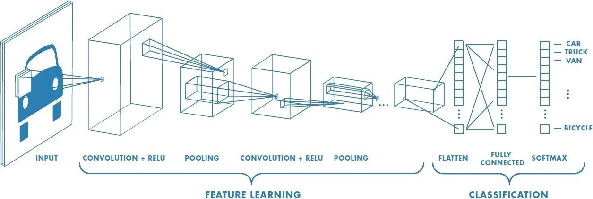
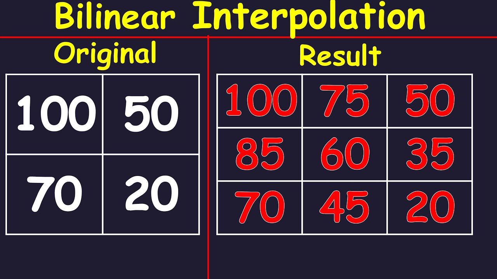
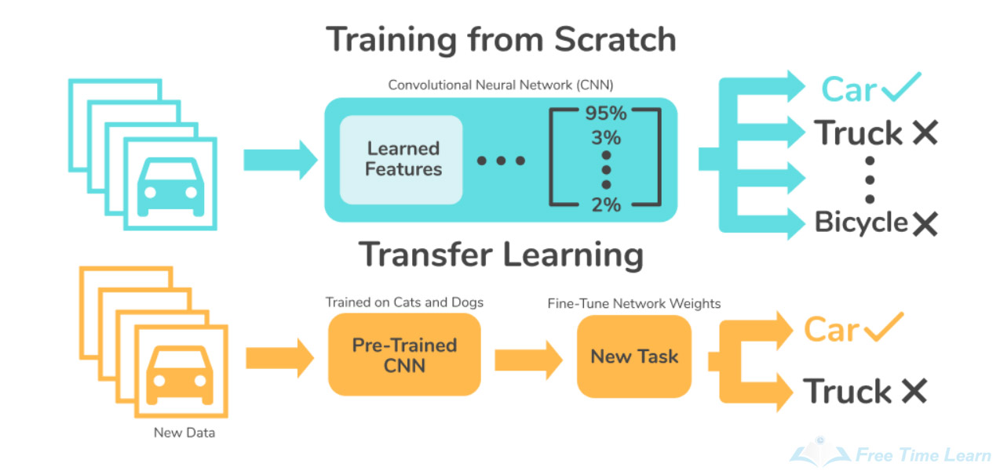

# Lecture 1: Jan17 2024

## Basic of image
- Every pixel of an image show the intensity of image, RBG
- Every image has Height Width or depth.
- 3 diffent color map supperimpose to show the color image.

- each point is called pixel and each pixel has 3 color(RBG)
- every color image are in metrix(3x3x3)
- every color is made up of RGB intensity 

- higher the pixel better the image
- image has structure data, you will never found missing value, you will never find string value here, it has better structure and range is between 0 to 255.

## How our brain understand this is tree, sun or river?
> Because of the cluster of the yellow and pixel location of the sun

## what is the information in an image:
> pixel density or veriation of pixel density at different location in an image. 

## Why ANN cannot work for images?
 - We take an image, Flatten it and pass it to neural network. but it won't work, suppose we have an image(object sun, river, tree).
 - new pixel related to tree should combine in seperate manner, pixel related to river should combine in seperate manner and pixel related to sun should combine in a different manner.
 - we can not combine everything and pass it to neural network.
 - In mnist Handwritten dataset we can apply ANN because everything is black except the digit.

## convaluation process
 - it is a feature extraction process, 
## Concept of keranl
 - we want a machanism where i can extract the features at local level, that is where a concept of windows or kernal comes in.
 - A keranl is basically a metrix of certain weight much lower dimension then the image, let image maybe 100x100 and kernal will be 3x3.
 - A keranl is weight metrics, kernal will get supperimpose on an image, image have some value the keranl have some value.
 - we apply .dot product will happen, and pass it to activation and a neuron is generated.

 

### 1. Edge Filter(Vertical edge detector)
 
 - left size - white region, middle - dark region, right side - darker region
 - when there is same pixel then there is not edge, if they have differnt pixel then it is edge.
 - diffence in the pixel on right hand side and left hand size.
 - when we have this kernal and convalute to the image it mean we are search for edge in that image.
 - **Now question is that how to make cat detector, or circle detection, we do so by learning the weight**

## is it possible to find a car, or a tree from single keranl?
 - No, we need more then one keranl to find the car from the image.
 - We make a learnable kernal and convolute to an imaga and create the feature map.
 - if we have 100 of kernal then it create 100 of feature map.


## Feature Map
- Different Kernel would have learn different features from the image and presented it in the feature maps
- so basically i took the image of the sun, tree, and car, and then using the kernels i learnt different featueres of the sun, tree and car and presented them in feature maps.
- neural network is basically going to learn the weights of the kernels.

- **Dot product happen 3 channel of color with kernal**

## what is information in an image?
- Varision in the pixel intensity is the inforamtion of an image.
- certain pixel are club together or present together that form an object.

## what happend when we flatten an image?
- when we flatten the image complelty and crate the 1 dimenstitional vector that vector, that vector the problem is that we loos locational or speical corelational.

## Feature Extraction
- if we do dot product it will extract feature.
- suppose if my kernal contain plus sign if it do the dot product, we will get higher value where the plus sign is avalable else lower value at feature map.

## Important point related to kernal
 - 1x1 is very small kernal it can not detect anything
 - 2x2 is do not follow symetric
 - 3x3 follow synmetic that is why we are taking smalles kernal as 3x3.

## if we have large size kernal then what is the issue?
 - There is chances that sun and bird both can capture by single neuron.
 - risk of including other object in that location.

## if large kernal is issue then small kernal may also have problem?
 - for example, one 3x3 kernal can not be detect whole sun.
 - using the 3x3 kernal may not capture our sun properly.
 - there is not problem because one kernal create one feature map which is pass by one neuron.
 - one neuron can learn left part of sun, one neuron learn right part of sun, one neuron learn bottom part of neuron. so there is no issue. but if we take larger kernal size then there is an issue that both sun and tree capture by single neuron, and that neuron get confuse which output to product sun or tree.
 - so small size kernal is not has big risk.
 - small size kernal is less infomation but there is not risk of capturing nebouring object.

## where we are using the large size kernal. 
 - yet to answer

## why kernal has to be symetric not square
 - yet to answer

## What is the dimension of feature map
 - if you have 100x100 pixel image(RGB) and has 100 of 3x3 kernal, the output of feature map. we will get with strive=1 is find out using the formula
 - H' = [(H-f)s]+1
 - W' = [(W-f)s]+1
 - depth = no of filter we have applied
## now, how many parameter the above configuration has.
 - 28 because, for each 3x3 karnal we have 9 weight and we have 100 of them, which is (3x3x3)+1(bias)
 - Number of learnable parameter is independent of size of image.
 - it is depended upon the size of kernal

 

 ## Max Pool
  - max pool is also a kind of convalution operation only with some filter size, this operation took max out of it. 
  - remove unwanted neuron that is comes up during convolution.
  - this is a clean up process, we are saying just give me max out of it.
  - when we train a kernal which can learn only tree(suppose) object from an image, there is high chances that that kernal takes some part of sun(suppose) so for that we need some clean up process, this clean up process is called max pooling.
  - suppose we have 28x28x3 image and we apply dot product with 3x3x100 kernal it will generate 26x26x100 feature map.
  - we already know that dring colvalution it take the some part of neabouring object so this max pooling remove that part and takes the max out of it.
  - 
  - after this i would have clean feature map.
  - __Max pool don't have the weight so what it is doing in backpropagation, it convert back from 2x2 matrix to original 4x4 matrix__
  
  - for forward propation dimenality reduction backword propagation dimentaionly expension.

  image --> Conv --> Feature map --> max pooling --> reduct feature map --> flatten --> pass it to dence -- > you get y hat --> last find the loss

## Global Average Pooling
 - give the flatten vector

## Convolutional Neural Networks
 - Apply Convalution to extract feature and max pooling to clean up feature, repect twice thrise. max pooling get raid of unnessary neuron.
 - will do the **global max** at the end, which will give me most important feature of the each feature map.
 - using the global max, each map talk about the most import part of the tree in the feature map.
 - then we pass it to dense layer to predict the tree, that is what convoltution articture looks like.


## Flatten 
 - after the max pooling, we having much smaller feature map(4x4 suppose).
 - one thing we can do we average it out, or 
 - flatten the complete feature map beacuse all the other feature is already eliminiated, we left with our desire output(tree for example)

## Resizing
  - our aim is to reduct our image to 28x28 if the image size is 100x300, then how can you choose, crop it to 28x28, are you going to crop or zoom.
  - so for that we are using something called Bilinear Interpolation.
  - 

## Create a Squential Pipeline
  ```python
  def preprocess(train_data, val_data, test_data, target_height=128, target_width=128):

    # Data Processing Stage with resizing and rescaling operations
    data_preprocess = keras.Sequential(
        name="data_preprocess",
        layers=[
            layers.Resizing(target_height, target_width),
            layers.Rescaling(1.0/255),
        ]
    )

    # Perform Data Processing on the train, val, test dataset
    train_ds = train_data.map(lambda x, y: (data_preprocess(x), y), num_parallel_calls=tf.data.AUTOTUNE)
    val_ds = val_data.map(lambda x, y: (data_preprocess(x), y), num_parallel_calls=tf.data.AUTOTUNE)
    test_ds = test_data.map(lambda x, y: (data_preprocess(x), y), num_parallel_calls=tf.data.AUTOTUNE)

    return train_ds, val_ds, test_ds
  train_ds, val_ds, test_ds = preprocess(train_data, val_data, test_data)
  ```

## Model Architecture
```python
def baseline(height=128, width=128):
    num_classes = 10
    hidden_size = 256

    model = keras.Sequential(
        name="model_cnn",
        layers=[
            layers.Conv2D(filters=16, kernel_size=3, padding="same", activation='relu', input_shape=(height, width, 3)),
            layers.MaxPooling2D(), #by default pool size=(2x2) and stride size=2
            layers.Flatten(),
            layers.Dense(units=hidden_size, activation='relu'),
            layers.Dense(units=num_classes, activation='softmax')
        ]
    )
    return model
model = baseline()
model.summary()
```

```python
Model: "model_cnn"
_________________________________________________________________
 Layer (type)                Output Shape              Param #   
=================================================================
 conv2d (Conv2D)               (None, 128, 128, 16)     448       
                                                                 
 max_pooling2d (MaxPooling2D)  (None, 64, 64, 16)        0          
                                                                                                        
 flatten (Flatten)             (None, 65536)             0         
                                                                 
 dense (Dense)                 (None, 256)              16777472  
                                                                 
 dense_1 (Dense)               (None, 10)               2570      
                                                                 
=================================================================
Total params: 16,780,490
Trainable params: 16,780,490
Non-trainable params: 0
_________________________________________________________________
 - H' = [(H-f)s]+1
 - W' = [(W-f)s]+1
 - depth = no of filter we have applied
```

## Overfitting(Data Augmentation)
 - to remove the overfitting we are using Data Argmentation
 - left, right, up size down etc rolated, zoom image, scaled down image also a cat, crop image of a cat is cat.
 - to create our model much robust, because it see more variation of the training data.
 - to show the variation of image.

## Image Augmentation
  + what is Augmentation? 
      - using this we are making our model more robust
      - Color, Increse the sharpness
      - reduce the light
      - rotate the image
      - zoom the image
      - shift the image here and there
      - crop the image
    these are real life image. we need some veriation of the image to train, we can not say we need only those image where line is at the center of the image.
  + camera angle might be different there may be differnt angle, there might be zoom-In or Out image.
  + we have to make a model in such a way that if i have a cat classifer if it sleeping my model should predict it is a cat, if it is running my model should predict it is cat and like so on. if my cat oocuping 90% of image then also my model should predict it is a cat.
  + so during the training process, can i rotate the image, can i zoom in the image, can i do some random transformation to the image while sending to the training pipeline. this is what called data augmentation.
  + *def*- during the training process the model not only learning the images but also learing the variation of the image. for exmple variation of zoom in cat, variation of rotation cat etc.
  + Augmentation is a technique to artificially increase the amount of data by generating new data points from existing data.

### How can we increase the data from existing data?
  > By making Minor changes such as flips, translations,brigntness,coloring, rotations etc.

### How does it help with training?
  > This leads to greater diversity of data samples being seen by the network hence decreasing the likelihood of overfitting the model on the training dataset.
  >Also it helps in reducing some of the spurious characteristics of the dataset.

### What different sort of Augmentation strategies we can apply?
  + Some most common data augmentations are:
      padding
      random rotating
      re-scaling,
      vertical and horizontal flipping
      translation ( image is moved along X, Y direction)
      cropping
      zooming
      darkening & brightening/color modification
      grayscaling
      changing contrast
      adding noise
      random erasing
      sharpness: image + lambda(image-cv2.gaussianBlur(image))
      contrast: low pixel < 20 to 0, higher then > 200 to 255
      brightness: (all pixel + 10)

### data generator:
  + it is kind of pipeline where, which is directly connected to the image folder, and from there we can acturally send images to the model.
  + it is like a tap, when you open the tap it will give image if you close the tap is will stop giving you images.
  + suppose it have 40000 image, after sending this 40000 images you can futher dement the image from this pipeline.
  + what is the advantage: if you have 40000 good HD qualtiy image in you hardisk, and you wanted to use to train the model, if you read the entire 40000 hd image, you RAM got out of memory.
  + to prevident this, we use data generator, what it do it open the tap and take 512 image train the model flush the image, again it take next 512 image train the model flush down the image, and the things go on. that is the benifit of data generator. by the way 512 image is batch size.
  + Augementation can be a part of data generator or the model pipeline, depend upon the architecture of the model, previouly it was a part of data generator now, it is the part of model pipeline.
  + keras has also argumentation layer in the sequential model
  + this argumentation apply some random(crop, resize, brightness etc) thing to the image and pass it the model to train the model.
  + you will never run out of image, because of whenever you need image, you just turn on the tap and it will give the some image and you can argument the image and you have enoght image to train your model.
  + theoryticaly you can not run out of images, because of image argumentation layer.

### why can't you do argumentation in tabular data?
  + if we do some row change then whole regress will change or the class/label change. that is why we can not argument the tabular data.
  + oversampling is duplicate data but this is argumented data.
  + but in the case of image, if we zoom in, crop, increae or decrese the image, it will alway repersent the cat.

### Causing in using image augumenation.
  + we can not drastically use of augumenation, if you do to much zooming it may put the object(cat) out of image.

## How do we apply augmentation in tensorflow / keras?
  There are many ways to apply augmentation in Tensorflow/Keras, few of them are discussed here:

  1. using the Keras Preprocessing Layers, just like preprocessing functions like resizing and rescaling, keras also provides data augmentation layers like tf.keras.layers.RandomFlip, tf.keras.layers.RandomRotation, etc. These can be used in a similar way as we used the preprocessing functions.
  1. using tf.image methods like tf.image.stateless_random_flip_up_down, tf.image.stateless_random_brightness
  1. using Keras ImageDataGenerator API - It provides quick, out-of-the-box suite of augmentation techniques like standardization, rotation, shifts, flips, brightness change, and many more.

## what is padding?
  + padding help to start the corner left of the image, and does help in not lossing the information.
  + using padding we can retain the size of feature map as original image.
  + padding='same','valid' in this case Height and weight will be same as orginal image.
  + with padding (padding='same')
    - H' = [ (H+2P-f)/s]+1
  + without padding (padding='valid')
    - H' = [ (H-f)/s]+1

### when to use padding?
  + do some research,
  + advantege of using it.
  + when to use or not to use.

## Backpropagation in CNN
  + adjest the weight and biases
  + backpropagate from right to left
  + unpooling maintain the same dimension


# Introduction to Transfer Learning
1. Transfer learning 
  - ML models are not exchangeable, for example churn of google model can not make sence to Amazon or meta.
  - Example of Transfer learning, suppose i have train my model with 5000 images but my friend has train his model more then 50k image data. so i can call my friend and ask my friend to give me their model for my prediciton. this is good example of transfer learning.
  - Transfer learning is duable in image data.
  - z-score of age of USA population is differnt then the Z-score of age of indian populaution.
  - another example, in my laptop value of pixel (255,66,54) is as through out all the laptop, there is unifomality in image data.
  - we can fine tune and train the model of our interest. 

understand the Tranfer learning (with VGG arthicecture) 
 + In the concept of tranfer learning, you used a pre-train model in which in all the layers the weights and bias are fixed, but on top of that you apply your own dense layer and then you do classification. 
 

### VGGNet(Standard CNN Architecture)
  - Very deep Convolutional networks for large-scale image recongnition.
```python
pretrained_model = tf.keras.applications.VGG16(weights='imagenet', include_top=False, input_shape=[224,224, 3])
# "Get the first few blocks of pretrained model and freeze them"
#1. break this pretrained model into two halves. first half is what you will freeze, 2nd half you will keep as it is
#2. sequential api (1st half, 2nd half, flatten, dense)
pretrained_model.trainable=False
vgg16_model = tf.keras.Sequential([
    pretrained_model,
    tf.keras.layers.Flatten(),
    tf.keras.layers.Dense(10, activation='softmax')
])

import functools
top5_acc = functools.partial(tf.keras.metrics.SparseTopKCategoricalAccuracy())

vgg16_model.compile(
    optimizer='adam',
    loss = 'sparse_categorical_crossentropy',
    metrics=['accuracy']
)

history = vgg16_model.fit(train_ds, epochs=5, validation_data=val_ds)
```

### AlexNet(Standard CNN Architecture)
  - big filter lower depth and VGGNet smaller filter bigger depth.


## Image Similarity: Understand Image Embeddings
  - Given an image we can pass it to conv max pooling, conv max pooling multiple itmes.
  - which then i will do gobal averge pooling or i can do flatten to get a 1-dimensional vector
  - then pass it to dence layer to predict cat, dog or +ve, -ve whatever.
  - and based on that your backpropagation happen and your weights get updated.

### cosine similarity of two vector
  - if the cosine similarity of two vector is high then we can say those 2 vector are similar
  ### Cosine Similarity Formula
Cosine similarity is a measure of similarity between two non-zero vectors of an inner product space. It measures the cosine of the angle between them. The formula for computing cosine similarity between two vectors \( \mathbf{a} \) and \( \mathbf{b} \) is:

\[
\text{similarity} = \frac{{\mathbf{a} \cdot \mathbf{b}}}{{\|\mathbf{a}\| \cdot \|\mathbf{b}\|}}
\]

Where:
- \( \mathbf{a} \cdot \mathbf{b} \) is the dot product of vectors \( \mathbf{a} \) and \( \mathbf{b} \)
- \( \|\mathbf{a}\| \) is the Euclidean norm (magnitude) of vector \( \mathbf{a} \)
- \( \|\mathbf{b}\| \) is the Euclidean norm (magnitude) of vector \( \mathbf{b} \)

In Python, using NumPy, you could compute the cosine similarity of two vectors as follows:

```python
import numpy as np

def cosine_similarity(a, b):
    dot_product = np.dot(a, b)
    norm_a = np.linalg.norm(a)
    norm_b = np.linalg.norm(b)
    similarity = dot_product / (norm_a * norm_b)
    return similarity

# Example usage:
vector1 = [1, 2, 3]
vector2 = [4, 5, 6]

similarity = cosine_similarity(vector1, vector2)
print("Cosine Similarity:", similarity)


